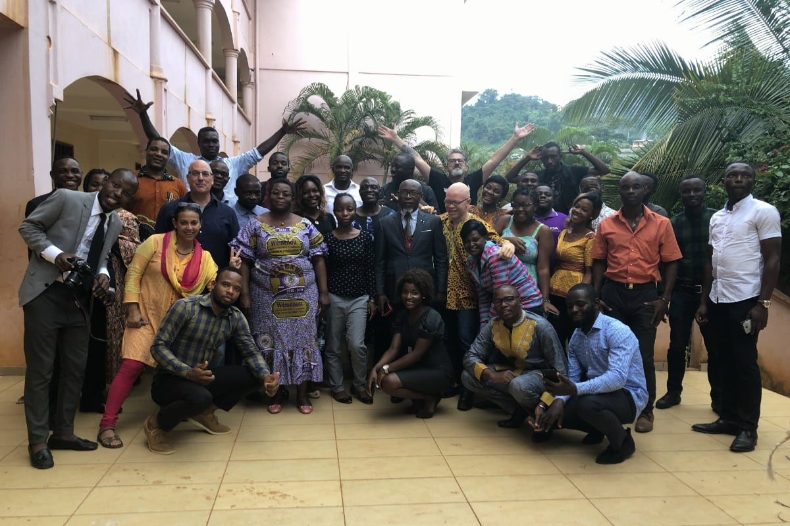

# 🇨🇲 Yaoundé web design workshop

CBI and IBAY Web Design Workshop held November 5-7, 2019

I can add a change and add a [link](https://www.qgis.com)

## 👉 Objectives

To provide training in HTML, CSS, Web Design and Web Site Development for students and early career professionals at HEIS, IITA and CRESA.

## 👉 Outputs

Each student will design and build a personal website.

> “On Tuesday morning, my students knew no HTML or CSS. Today, they’re publishing their first web page, using CSS Grid.”   
> – Andy Clarke

## 👩‍👩‍👦‍👦 Student websites and GitHub profiles

1. [Freddy Sany](https://fred-2019.github.io) | [GitHub Profile](https://www.github.com/fred-2019)

1. [Kamta Romeo](https://kamta19-web.github.io/) | [GitHub Profile](https://www.githun.com/kamta19-web)

1. [Eric Onguene](https://eric8514.github.io) | [GitHub Profile](https://www.github.io/eric8514)

1. [Julia-yossa's website](https://julia-yossa.github.io/CJulia-yossa.github.io/) | 
[GitHub Profile](https://github.com/julia-yossa)

1. [Blondelle Mélina Atsafack](https://lablondasse.github.io) | [GitHub Profile](https://www.github.com/lablondasse)

1. [kamkodoriane](https://kamkodoriane.github.io/)
 | [GitHub Profile](https://github.com/kamkodoriane)

1. [Tchuekam Tchatchoua Alain Michel](https://michel1302.github.io/) 
 | [GitHub Profile](https://michel1302.github.io/)

1. [dassikouam](https://dassikouam.github.io/)
 | [GitHub Profile](https://www.github.com/dassikouam)

1. [Ngwa Rogers](https://rogers8619.github.io/)
 | [GitHub Profile](https://www.github.com/rogers8619)

1. [Godswill Ntsomboh Ntsefong](https://GodswillNN.github.io)
 | [GitHub Profile](https://www.github.com/GodswillNN)

1. [Ndifor James Nih](https://njnih.github.io)
 | [GitHub Profile](https://www.github.com/njnih)

1. [Alain Brice Tonle Tonle](https://ttab303.github.io/)
 | [GitHub Profile](https://www.github.com/ttab303)

1. [Ousseni Mfouapon Mbohou](https://oussenimbohou.github.io)
 | [GitHub Profile](https://www.github.com/oussenimbohou)

1. [tchanou-tchapda](https://tchanou-tchapda.github.io)
 | [GitHub Profile](https://github.com/tchanou-tchapda)

1. [Eric Nana](https://ericnana2000.github.io/)
 | [GitHub Profile](https://www.github.com/ericnana2000)

1. [Raoulsandjo.github.io](https://raoulsandjo.github.io)
 | [GitHub Profile](https://www.github.com/raoulsandjo)

1. [Ashu Mpey Ayuk Bernice](https://ashumpey.github.io/)
 | [GitHub Profile](https://www.github.com/ashumpey)

1. [Menye Yollande](https://menyeyollande.github.io)
 | [GitHub Profile](https://www.github.com/menyeyollande)

1. [Eric Rostand](https://eric8514.github.io)
 | [GitHub Profile](https://www.github.com/eric8514)

1. [Nicole Maffo](https://nicole-maffo.github.io/)
 | [GitHub Profile](https://www.github.com/nicole-maffo)

1. [Deguema](https://juniordeguema.github.io)
 | [GitHub Profile](https://www.github.com/juniordeguema)

## 👨‍🏫 Instructor Websites

### 🦍 Andy Clarke
- [Stuff and Nonsense](https://stuffandnonsense.co.uk/)
- [Articles on Smashing Magazine](https://www.smashingmagazine.com/author/andy-clarke/)
- [On Twitter](https://twitter.com/Malarkey)
- [GitHub Profile](https://github.com/malarkey/)
- [Beardy Scientist](http://beardyscientist.com/)

### 🐴 Scott Gruber
- [scottgruber.me](https://scottgruber.me/)
- [UCLA](https://www.ioes.ucla.edu/person/scott-gruber/)
- [Talks](https://speaking.scottgruber.me/)
- [Side Project: 100 CSS Grid Layouts](https://scottgruber.github.io/100-layouts/)
- [On Twitter](https://twitter.com/scott_gruber)
- [GitHub Profile](https://github.com/scottgruber/)

## 🔗 Links

## Responsive designs

- [Responsivedesign.is](https://responsivedesign.is/examples/)  
A curated collection of responsive designed websites. Each site features a screenshot across 4 device widths and you can see the media queries, viewport and resources that have been used to create the site.

- [MediaQueries](https://mediaqueri.es/)  
A collection of inspirational websites using media queries and responsive web design. 

## 👍 Free video courses

- [CSS Grid: Let's get Griddy with it](https://cssgrid.io/)  
Learn CSS Grid: From fundamentals to Real World in about 4 hours.

- [What The FlexBox?!](https://flexbox.io/)  
A simple, free 20 video course that will help you master CSS Flexbox!

- [Learn CSS Variables for free](https://scrimba.com/g/gcssvariables)  
This tutorial teaches you CSS Variables through eight interactive screencasts. It's value-packed from beginning to end, and is probably the fastest way to get an in-depth understanding of CSS Variables.

- [Learn CSS Grid for free](https://scrimba.com/g/gR8PTE)  
This tutorial teaches you CSS Grid through 14 interactive screencasts. You'll learn all the key concepts while building three awesome layouts: a website, an image grid, and an article. Plus, you'll learn how to combine CSS Grid with Flexbox.

- [Learn Flexbox for free](https://scrimba.com/g/gflexbox)  
This tutorial teaches you CSS Flexbox through 12 interactive screencasts. You'll learn all the key concept in addition to building a responsive navbar and a neat image grid.

- [HTML & CSS Crash Course](https://scrimba.com/g/ghtmlcss)  
Learn to build your very first web pages with this four hour course on HTML and CSS.

- [Introduction to HTML](https://scrimba.com/g/ghtml)  
Learn HTML5 by building your own website in less than an hour! This 15-part interactive tutorial is the perfect starting point for beginners who're looking for an introduction HTML to web development.

### ️👍 W3C Online Courses Free!
Learn how to build Web sites using HTML5 and basic CSS, directly from W3C, creator of the latest Web standards.

1. [HTML5 and CSS Fundamentals](https://www.edx.org/course/html5-and-css-fundamentals-3)  
1. [CSS Basics](https://www.edx.org/course/css-basics-2)

### 👍 Learn the Web  
Learn the Web is a structured, curated, living guide to web development for graphic designers. Good reference materials available.

1. [All Topics](https://learn-the-web.algonquindesign.ca/topics/)
1. [Using Paths and Folders](https://learn-the-web.algonquindesign.ca/topics/paths-folders/)
1. [Naming Files Rules](https://learn-the-web.algonquindesign.ca/topics/naming-conventions/)
3. [Basic typography](https://learn-the-web.algonquindesign.ca/topics/basic-typography/)

### 🛠 Carpentries
Teaching basic skills for research computing. Online workshops for Python, R, Ecology, Genomics, Geospatial Data, Working with Data, OpenRefine.
- [Software Carpentry workshops](https://software-carpentry.org/lessons/)
- [Data Carpentry workshops](https://datacarpentry.org/lessons/)
- [Library Carpentry workshops](https://librarycarpentry.org/lessons/)
- [Git for Novices](http://swcarpentry.github.io/git-novice/)
- [Programming with R](http://swcarpentry.github.io/r-novice-inflammation/)
- [Programming with Python](http://swcarpentry.github.io/python-novice-inflammation/)

###  GitHub

- [Getting started with GitHub Desktop](https://help.github.com/en/desktop/getting-started-with-github-desktop)
- [Getting started with GitHub](https://help.github.com/en/github/getting-started-with-github)
- [Working with GitHub Pages](https://help.github.com/en/github/working-with-github-pages)
- [Mastering Markdown](https://guides.github.com/features/mastering-markdown/)

### 📰 Free Email Newsletters

- [CSS Layout News](http://csslayout.news/)  
A weekly collection of tutorials, news and information on all things CSS Layout by Rachel Andrew
- [Veerle's Designers newsletter](https://veerle.duoh.com)  
A weekly newsletter filled with design inspiration, a curated downloadable swatches color palette, quick design tips and the same resources I learn from.
- [Responsive Design Newsletter](http://responsivedesignweekly.com/)  
A once-weekly round-up of responsive design articles, tools, tips tutorials and inspirational links.

### 📚 Books

- [Learning Web Design by Jennifer Robbins](https://learningwebdesign.com/)
- [Pro Git by Scott Chacon and Ben Straub](https://git-scm.com/book/en/v2)
- [Pro Git by Scott Chacon and Ben Straub Français](https://git-scm.com/book/fr/v2)
- [Art Direction for the Web by Andy Clarke](https://stuffandnonsense.co.uk/artdirectionfortheweb/)

## 🎨 More Resources and Sites

### W3C: Standards and Accessibility
The World Wide Web Consortium (W3C) is an international community that develops open standards to ensure the long-term growth of the Web. 
- [Web Accessibility Initiative](https://www.w3.org/WAI/)  
Strategies, standards, resources to make the Web accessible to people with disabilities
- [W3C Web Design Standards](https://www.w3.org/standards/webdesign/)  
Web Design standards for building web pages, including HTML, CSS, SVG, device APIs.

### Fonts
- [Google Fonts](https://gridbyexample.com/)
- [Modular Scale for Typography](https://www.modularscale.com/)

## [Mozilla Developer Network](https://developer.mozilla.org/)

### 👉 CSS Grid
1. [Quickly master CSS Grid](https://mozilladevelopers.github.io/playground/css-grid/)

1. [CSS Grid Layout](https://developer.mozilla.org/en-US/docs/Web/CSS/CSS_Grid_Layout)

### 👉 Web Developer information

1. [Learn Web Development](https://developer.mozilla.org/en-US/docs/Learn)
1. [Getting started with the Web](https://developer.mozilla.org/en-US/docs/Learn/Getting_started_with_the_web)
1. [Learn HTML](https://developer.mozilla.org/en-US/docs/Learn/HTML)
1. [Learn CSS](https://developer.mozilla.org/en-US/docs/Learn/CSS)
1. [Learn JavaScript](https://developer.mozilla.org/en-US/docs/Learn/JavaScript)

### 👉 CSS: Cascading Style Sheets
1. [CSS Introduction, Tutorials and Reference](https://developer.mozilla.org/en-US/docs/Web/CSS)
1. [CSS Flexbox Layout](https://developer.mozilla.org/en-US/docs/Web/CSS/CSS_Flexible_Box_Layout)
1. [CSS Variables](https://developer.mozilla.org/en-US/docs/Web/CSS/Using_CSS_custom_properties)
1. [CSS Shapes](https://developer.mozilla.org/en-US/docs/Web/CSS/CSS_Shapes)
1. [CSS Transforms](https://developer.mozilla.org/en-US/docs/Web/CSS/transform)
1. [CSS Animation](https://developer.mozilla.org/)

## 🎮 Games

- [CSS Grid Garden](http://cssgridgarden.com/)
- [Flexbox Froggy](https://flexboxfroggy.com/)

## 👍 More on CSS Grid
1. [Grid by Example by Rachel Andrew](https://gridbyexample.com/)  
Everything you need to learn CSS Grid Layout
1. [CSS Grid Generator](https://cssgrid-generator.netlify.com/)
2. [CSS Tricks Guide to CSS Grid](https://css-tricks.com/snippets/css/complete-guide-grid/)

##  🛠 Apps

### 👉 Text Editors
- [Visual Studio Code](https://code.visualstudio.com/)
- [Atom.io](https://atom.io/)

### 👉 Git
- [GitHub Desktop](https://desktop.github.com/)
- [Git Kraken](https://www.gitkraken.com/)
- [Git](https://git-scm.com/)
- [Git GUI Clients](https://git-scm.com/downloads/guis/)

### 👉 Browsers
- [Google Chrome](https://www.google.com/chrome/)
- [Firefox](https://www.mozilla.org/en-US/firefox/)

### 👉 Graphic and Video Editors
- [Gimp, photo editor](https://www.gimp.org/)
- [Inkscape, illustration](https://inkscape.org/)
- [OpenShot, video editor](https://www.openshot.org/)

### 👉 Server
- [MAMP](https://www.mamp.info/en/)

## 👉 Social developer tools

- [Glitch](https://glitch.com/)
- [Codepen](https://codepen.io/)  
  
---  

###  

# Program

## Day 1

### Session 1: Setup 

- Introduction
- Tools & Apps
- Naming conventions
- Using paths & folders
- Demo blank web site

#### Hands on

- Setup your computer
- Create first HTML and CSS

### Session 2: How do I build a web page? 

- HTML tags
- CSS properties
- Look at how to write HTML and how to choose the proper HTML tags
- Learn how to change the colors and type on a website.

#### Hands on

- Markup text file

### Session 3: How do I build a website?

- Demo blank site
- Setup files and folders
- Page structure
- Setup nav links
- Writing for the web

#### Hands on

- Plan your site by sketching, writing text
- Starting to write code and make pages
- Setup nav links
- Markup text on pages

### Session 4: How do I publish a website?

- Version control & GitHub
- How to use GitHub
- Push and Pull
- Fork and clone a repo
- Publish to GitHub Pages
- Demo GitHub Pages

#### Hands on

- Create “Hello World” web page
- Setup GitHub account
- Working with Git
- Publish to GitHub

## Day 2

### Session 5: Photography for the Web
- Using mobile phone camera
- Framing and Light
- Photograph people and landscapes
- Prepare photos for the web

#### Hands on
- Take photos
- Prepare photos for the web
- Add photos to your site

### Session 6: Design for the Web

- Atmosphere
- Color
- Type

#### Hands on

- Color palette
- Google fonts
- Modular Type Scale
- CSS custom properties

### Session 7: Art Direction for the Web

- Demo art directed layouts
- Building a Grid
- Layout and placing content

#### Hands on

- Design your site

## Day 3: 

### Session 8: Publish my website
- Debug and testing site
- Making changes

#### Hands on

- Finishing your site
- Publish your site

### Session 9: Presentations
- Next steps

 

